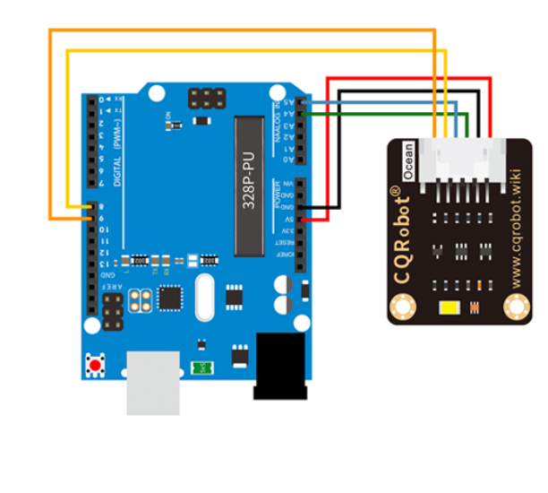

## Description
The data is expected to contain values for the red (RR), green (GG), and blue (BB) components. The sketch then creates a canvas and a set of serialCircle objects that are influenced by the received color values.

## Circuit
Here is the circuit.
I used Arduino UNO board in the circuit, since I didn't find the template in fritzing this time. 

## Logic
**Serial Connection Setup:**
   - The sketch initializes variables (`mSerial`, `readyForSerialData`, `serialButton`, `sendSuccess`) related to serial communication.
   - A button (`serialButton`) is created to initiate the serial connection.
**Functions:**
   - `readSerial()`: Reads data from the serial port until a newline character is encountered.
   - Parses the received JSON-formatted data using the `parseData` function.
   - `parseData(data)`: Extracts values for red (`RR`), green (`GG`), and blue (`BB`) from the received JSON data.
   - `connectToSerial()`: Attempts to open a serial connection when the button is pressed.
**Setup:**
   - Initializes the canvas and serial connection.
   - Creates a button for connecting to the serial port.
   - Initializes flags (`readyForSerialData`, `sendSuccess`) and creates instances of the `serialCircle` class.
**Draw:**
   - Checks if there's available data in the serial port using `mSerial.availableBytes()`.
   - Iterates through the `objects` array and displays instances of the `serialCircle` class.
   - The dimensions and appearance of these objects are influenced by the red (`RR`), green (`GG`), and blue (`BB`) values received from the serial port.
**SerialCircle Class:**
   - Represents a circular object influenced by the received color values.
   - Randomly initializes position, height, width, and oscillation factors.
   - Displays the object on the canvas with changing dimensions based on time.
